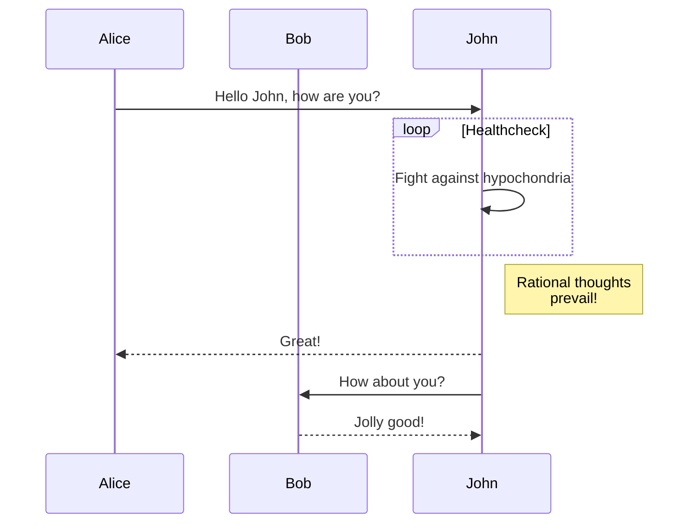
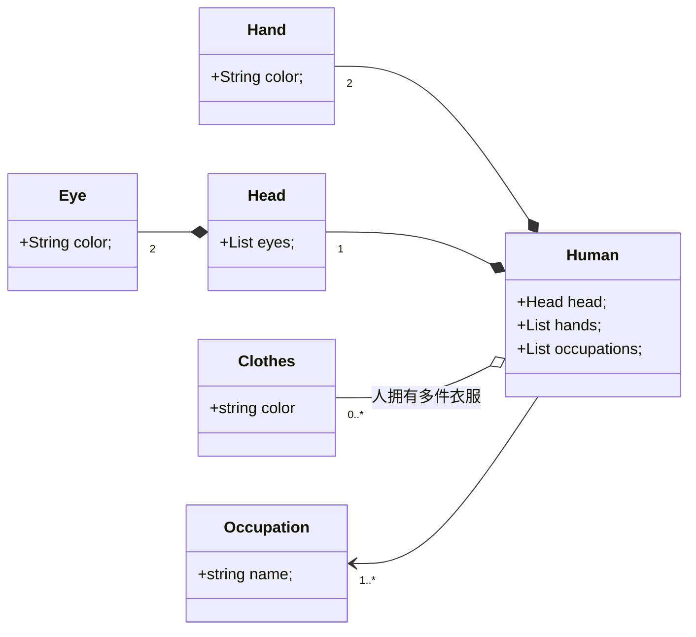
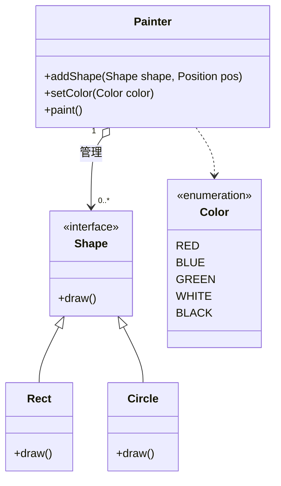

```mermaid

graph LR
    fa:fa-check-->fa:fa-coffee
```

```mermaid
graph TD;
    A-->B;
    A-->C;
    B-->D;
    C-->D;
```

```mermaid

sequenceDiagram

participant Alice

participant Bob

Alice->>John: Hello John, how are you?

loop Healthcheck

John->>John: Fight against hypochondria

end

Note right of John: Rational thoughts <br/>prevail!

John-->>Alice: Great!

John->>Bob: How about you?

Bob-->>John: Jolly good!

```

```mermaid

classDiagram

direction RL

class Human {

    +Head head;

    +List<Hand> hands;

    +List<Occupation> occupations;

}

class Hand {
    
    +String color;
}

class Eye {

    +String color;

}

class Head {

    +List<Eye> eyes;

}

class Clothes {

    +string color

}

class Occupation {

    +string name;

}

%% Human组合Head

Human *-- "1" Head

%% Human组合Hand

Human *-- "2" Hand

%% Human关联Occupation

Human --> "1..*" Occupation

%% Human聚合Clothes

Human o-- "0..*" Clothes : 人拥有多件衣服

%% Head组合使用Eye

Head *-- "2" Eye

```

```mermaid

classDiagram

direction TB

class Shape {

<<interface>>

+draw()

}

%% Rect和Circle继承Shape

Shape <|-- Rect

Shape <|-- Circle

class Rect {

+draw()

}

class Circle {

+draw()

}

class Painter {

+addShape(Shape shape, Position pos)

+setColor(Color color)

+paint()

}

%% Painter聚合引用Shape

Painter "1" o--> "0..*" Shape : 管理

%% Painter依赖Color枚举

Painter ..> Color

class Color {

    <<enumeration>>

    RED

    BLUE

    GREEN

    WHITE

    BLACK

}

```
